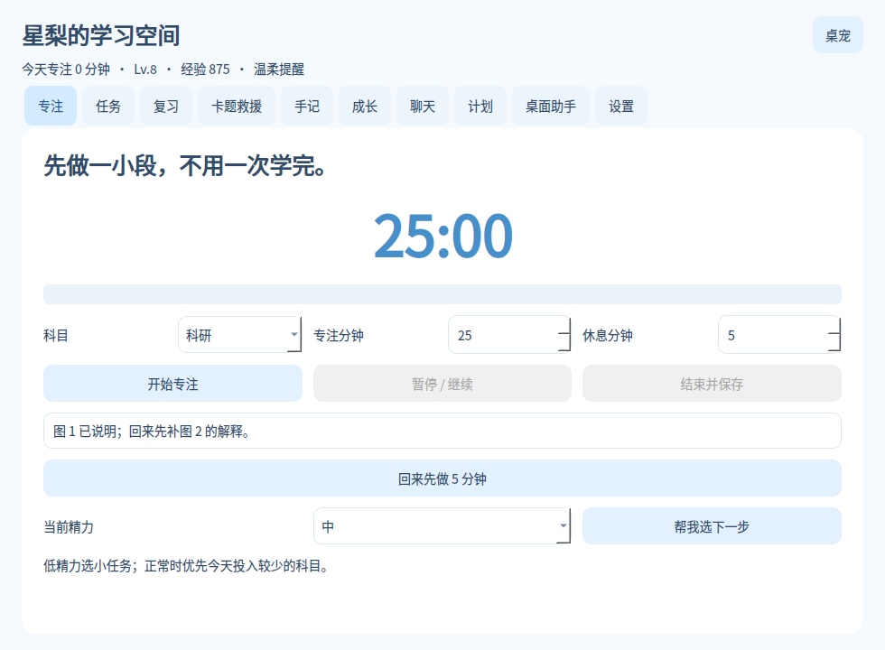

# LR StudyPet · 星梨 v0.2.0

**你敲键盘，她也陪着敲；你学到一半离开，她帮你留住下一步。**

[English](README.en.md) · [Windows 下载](https://github.com/LLR6/LR-StudyPet/releases) · [反馈问题](https://github.com/LLR6/LR-StudyPet/issues)

原创浅蓝色二次元学习桌宠，把桌面互动和真正的复习流程接起来。

## v0.2 的桌面互动

| 功能 | 实际行为 |
|---|---|
| 键盘联动 | 手动开启后响应按键活动，角色出现敲键盘动效；不解码或保存输入文字 |
| 剪贴板上一条 | 手动开启，仅内存保留最多 60 秒；恢复上一条、立即清空，不写入磁盘 |
| 桌面整理建议 | 查看一个目录层级的扩展名、大小、修改时间与相似名字；不移动或删除 |
| 命令助手 | Windows 按 Ctrl+Alt+Space，输入前缀或中文需求，查看说明并复制；不自动执行 |
| 开机自启动 | Windows 设置页可开启/关闭；保持程序目录位置，搬家后需重新开启 |
| 动效与互动 | 30 FPS 浮动、摸头小跳、星光、伸懒腰、打字键盘、桌宠大小调节 |

剪贴板记忆每次启动默认关闭；关闭记忆立即清空。60 秒失效只清除桌宠的记忆，不清除 Windows 剪贴板。
命令助手没有截取终端文字；快捷键若被其他程序占用，可从桌面助手页或桌宠右键打开。

浅蓝色原创二次元学习桌宠，Windows 10/11 x64。

## 快速启动

下载 Windows 便携包，**完整解压**，双击 `Start.cmd`。
已包含 Python 与 Qt 运行时，不需要另装 Python，也不用执行 pip。
请不要在压缩包里直接双击程序；不要单独移走 bin 或 runtime 文件夹。
关闭学习窗口只收起面板；右键桌宠或托盘，选择「退出」。

源码包不含运行时。开发运行：安装 Python 3.12/3.13 后双击 `Start-Windows.bat`，首次需要联网下载依赖。

## 已实现

1. 原创浅蓝色二次元女孩：待机、读书、庆祝、休息四种姿态与轻微浮动。
2. 透明悬浮、置顶、拖拽、位置记忆、摸头互动、托盘隐藏和恢复。
3. 自定义专注与休息时长、暂停、继续、提前结束、专注完成自动转入休息。
4. 数学 / 英语 / 政治 / 408 / 其他科目分类统计。
5. 本地任务清单、完成与撤销、从任务直接开始专注。
6. 中断书签：记录做到哪与下次第一步，实时保存，重启还能看见。
7. 精力选任务：低精力优先短任务；正常时优先当天投入少的科目。
8. 异常退出恢复：专注时每 5 秒保存一次检查点，重启选择保留已计时间。
9. 间隔复习卡：先回忆再揭示答案，自评后安排下一次复习。
10. 五种卡点的三步自救引导，卡点可存入手记。离线规则，不自动判断题目对错。
11. 收获、错因、明日第一步手记。
12. 七日分科统计、经验、等级；任务撤销会撤销相应经验。
13. 每日专注目标与进度条、用户自定义目标日期倒计时。
14. 本机定时提醒与已提醒状态。需要桌宠正在运行；关机时不会提醒。
15. 温柔健康提醒、安静模式、两分钟离屏休息。
16. Windows 合成雨声开关。
17. 离线简单陪伴指令：下一步、休息、鼓励、复习。
18. 可选兼容 Chat Completions 接口的 AI 问答。
19. JSON 学习备份、恢复前自动备份、事务恢复。

## 建议的学习流程

添加一个明确的小任务 → 开始专注 → 卡住时写具体卡点并使用自救单 →
结束前写一句下次第一步 → 把错因变成复习卡 → 第二天先做到期复习。

例如，中断书签可以写：`PV 题已确定 empty=5，回来先检查 P 操作顺序。`
「帮我选下一步」按公开的简单规则推荐，尚未采用预测模型。
复习间隔：没记住 1 天，费力想起至少 2 天后，轻松掌握至少 4 天后；以后随间隔扩大。

## 可选 AI

不开 AI，所有计时、任务、复习、统计均可用。联网聊天需要你已有的服务商接口。
在设置填写 HTTPS 接口地址（例如服务商提供的 `/v1` 地址）和模型名。
在 Windows 搜索「编辑账户的环境变量」，新建用户变量 `LR_PET_API_KEY`，值为你的密钥。
完全退出桌宠再重新启动，然后勾选启用联网 AI 并保存。

只发送聊天框中的本条消息与固定角色提示。不会自动上传手记、任务、截图、键盘或屏幕内容。
当前每条问答独立，不发送历史上下文。连接请求最长约 45 秒；等待时不能退出。
密钥不写进程序、学习数据库或备份。服务商可能按使用量收费。
尚未使用真实账户验证在线 AI；接口实际兼容性由服务商决定。

## 数据与备份

Windows 数据：`%LOCALAPPDATA%\LR-StudyPet\study.sqlite3`。
学习备份包括任务、专注记录、复习卡和手记，不包括 AI 配置、提醒与界面设置。
恢复会替换学习记录，现有数据先自动导出到同一数据目录。
备份不是加密文件，请自行保管。

## 验证与当前边界

通过 15 项核心与桌面工具测试：暂停不累计、时间归零、复习重排、任务撤销经验、备份往返、坏备份不破坏现有数据、低精力选短任务。
通过 Linux Qt 离屏界面测试：任务→专注→暂停→继续→保存、复习、救援、离线聊天、全部 10 个页签渲染。
发布前使用 GitHub Actions 的 Windows runner 执行单元测试、源码界面测试和打包后启动检查；具体运行结果以 Actions 为准。自动测试仍不等于所有个人电脑都实测过；真实键盘、通知、声音与在线 AI 仍需设备验证。
若启动失败，运行 `Start.cmd` 保留错误窗口反馈；程序错误会写入 `%LOCALAPPDATA%\LR-StudyPet\startup.log`（原生版也会显示错误弹窗）。
某些系统需要 Microsoft Visual C++ 2015–2022 x64 运行库：https://aka.ms/vs/17/release/vc_redist.x64.exe 。

当前无 Live2D、语音、截图识题、摄像头监督、窗口监控或云同步。
专注记录来自手动计时，不能证明实际学习效果。
特色是中断书签、卡点→复习卡、精力→任务之间的组合，不宣称全球首创。

## 开发与许可

源码：Python + PySide6 Essentials + SQLite。`python -m unittest -v` 运行核心测试。
Windows 可运行 `Build-EXE.bat`，本机使用 PyInstaller 生成可执行分发目录。
原始角色素材由图片生成制作，包含四种姿态；完整最终配色要求见 `assets/prompt.txt`。
自有程序源码采用 MIT，角色素材可随本项目使用；第三方依赖遵守各自许可。
便携包含 Python 3.12 系列运行时、PySide6 Essentials 6.8.3、Shiboken6 6.8.3；许可说明见 `THIRD_PARTY.md`。
