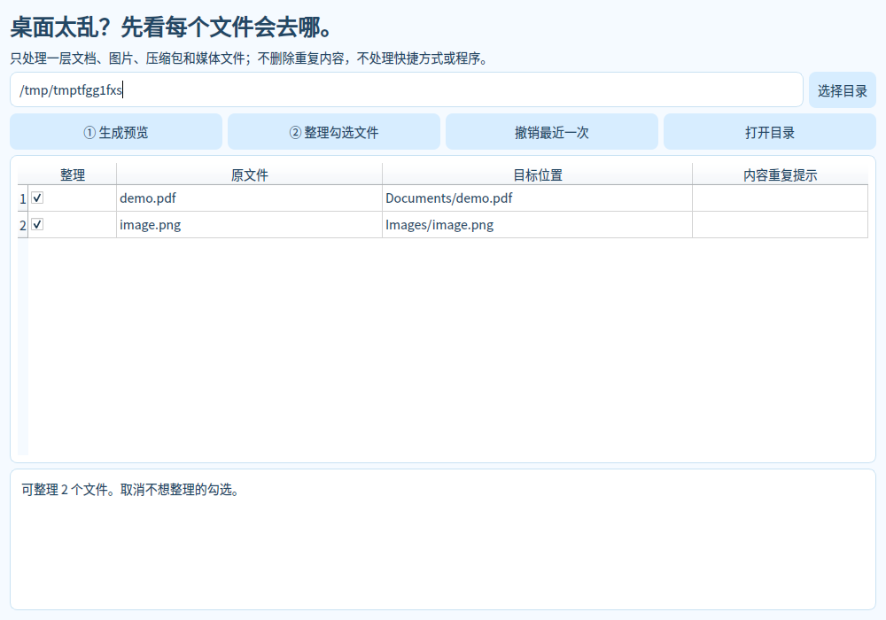

# LR DeskTidy

Preview where every file goes. Select what to move. Undo without overwriting newer files.

A local organizer for one directory level: documents, images, archives and media. Shows per-file destinations, retains duplicate content, avoids overwrites, validates files again before moving and writes an undo journal. Changed destinations or occupied original paths are preserved during undo.

Install Python 3.12/3.13, run `pip install -r requirements.txt`, then `python app.py`. Windows Start.cmd handles setup. Portable artifacts are built in the parent StudyPet Actions workflow. A separate repository has not been created yet.

Limits: 128 MB per file, 500 files per preview. No folder recursion, shortcut/program moves, duplicate deletion, telemetry or cloud sync. Keep `.lr-desktidy` for undo. Do not concurrently rename/edit files during a move. POSIX moves require hard-link support on the same filesystem; Windows uses no-clobber rename. Empty category folders are retained. Moving the entire directory invalidates historical paths.

Tests: `python -m unittest -v`; isolated end-to-end GUI check: `python app.py --smoke-test`.

MIT · LR. Dependencies retain their own licenses.
