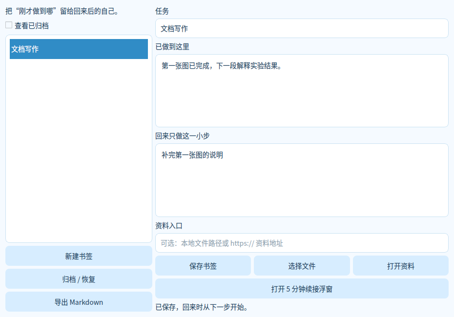

# LR ResumeDock

Leave one concrete next step before an interruption. Return without reconstructing your context.

Offline project bookmarks with context, next step, file/HTTPS links, autosave for saved bookmarks, archiving, Markdown export, and a small always-on-top five-minute restart timer.

Install Python 3.12/3.13, run `pip install -r requirements.txt`, then `python app.py`. On Windows use Start.cmd; portable Windows artifacts are built by the parent StudyPet Actions workflow. No separate repository exists yet.

Data stays in `%LOCALAPPDATA%\LR-ResumeDock` on Windows or `~/.local/share/LR-ResumeDock` elsewhere. No account, AI service, telemetry, keyboard capture, or cloud sync. In-flight timer time is not recovered after a crash. Saved bookmarks persist in SQLite.

Tests: `python -m unittest -v`; GUI check: `python app.py --smoke-test`.

MIT · LR. Dependencies retain their own licenses.
