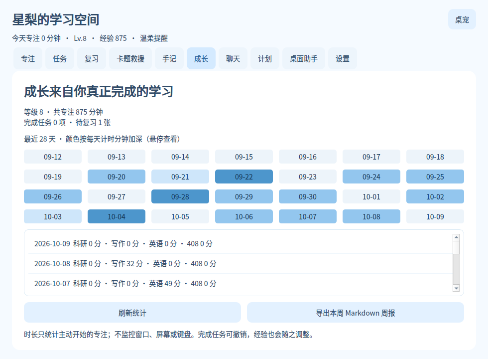

# 三个 30 秒可复现案例

## StudyPet：错题变复习卡，再看学习节奏

1. 在复习页导入 `examples/review-cards.csv`，预览并确认。
2. 选一张卡闭卷回答，再显示答案并自评。
3. 在专注页写“做到第二题，回来先检查第一行符号”，点“回来先做 5 分钟”。
4. 暂停、继续或提前结束；在成长页看热力图并导出周报。

演示图使用临时生成的数据，不代表真实学习成果。安装 Pillow 后运行 `python demo.py` 生成截图和演示 GIF，不读取真实学习数据库。

## ResumeDock：写作或编码被打断

保存“图 1 已解释，回来先补图 2 的说明”，附上本地文件路径。打开续接浮窗，点开始；离开时点暂停，回来继续。切换项目也不会把正在计时的时间记到另一个项目。

## DeskTidy：把散落资料分类，再撤回

在测试目录放两个 PDF、一张 PNG。点生成预览，取消其中一个 PDF 的勾选，再确认整理。检查分类文件夹；点击撤销，文件回到原处。

如果整理后又编辑了文件，撤销会保留当前文件并报告跳过；如果原位置被新文件占用，也不会覆盖。整理大目录前先在测试目录体验一遍。
